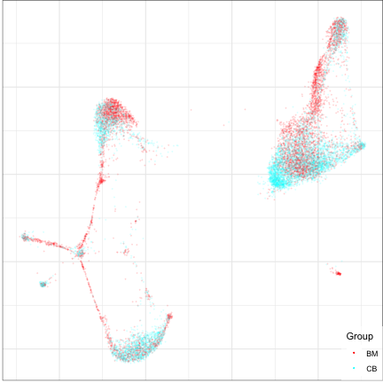
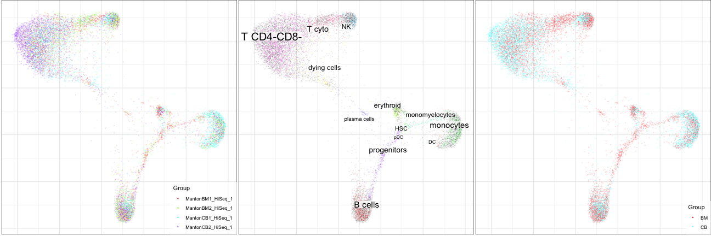
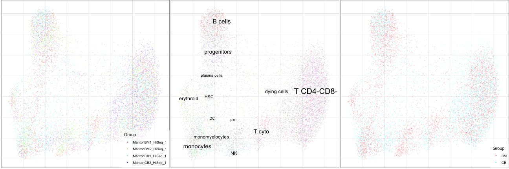
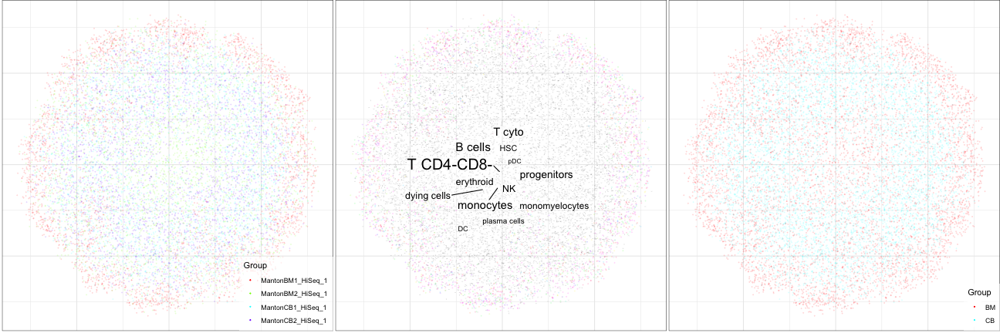

# Adjustment of Alignment Strength with Conos

This tutorial uses the same data as the main [Walkthrough](https://github.com/kharchenkolab/conos/blob/master/vignettes/walkthrough.md) to demonstrate different options 
for forcing alignment. It can be especially useful if the samples are grouped by some external 
condition (e.g. sequencing protocol or disease vs control).

## Load and align data

First, let's load the conos library and corresponding data:


```r
library(pagoda2)
library(conos)
library(magrittr)

panel <- conosPanel::panel
cellannot <- find.package('conos') %>% file.path('extdata', 'cellannot.txt') %>%
  read.table(header=FALSE,sep='\t') %$% setNames(V2, V1)
```

Then we can preprocess the samples with [pagoda2](https://github.com/kharchenkolab/pagoda2) and perform alignment:


```r
panel.preprocessed <- lapply(panel, basicP2proc, n.cores=4, min.cells.per.gene=0, 
                             n.odgenes=2e3, get.largevis=FALSE, make.geneknn=FALSE)
```

```
## creating space of type angular done
## adding data ... done
## building index ... done
## querying ... done
## creating space of type angular done
## adding data ... done
## building index ... done
## querying ... done
## creating space of type angular done
## adding data ... done
## building index ... done
## querying ... done
## creating space of type angular done
## adding data ... done
## building index ... done
## querying ... done
```


```r
con <- Conos$new(panel.preprocessed, n.cores=4)
con$buildGraph(k=20, k.self=5, space='PCA', ncomps=30)
```


```r
con$embedGraph()

con$plotGraph(color.by='sample', alpha=0.1, size=0.2, mark.groups=FALSE, 
              show.legend=TRUE, legend.pos=c(1, 0))
```


```r
con$plotGraph(groups=cellannot, alpha=0.1, size=0.2)
```


## Force alignment

In this dataset our samples are grouped by tissue (BM vs CB), so we can color by this factor:


```r
tissue_per_cb <- con$getDatasetPerCell() %>% substr(7, 8) %>% 
  setNames(names(con$getDatasetPerCell()))

con$plotGraph(groups=tissue_per_cb, alpha=0.1, size=0.2, mark.groups=FALSE, 
              show.legend=TRUE, legend.pos=c(1, 0))
```


So we now can see a clear separation. Indeed, it depends on the research question whether different 
tissues must be aligned completely, or they should form close, but separate clusters. And
one benefit of Conos is that it gives you the option to choose. There are three ways you can 
force a more aggressive alignment.

Let's first define the function `plotConosSummary` to show changes in the Conos graph:


```r
plotConosSummary <- function(con, cell.type.annot, tissue.annot, size=0.2, alpha=0.1, legend.pos=c(1, 0)) {
  cowplot::plot_grid(
    con$plotGraph(color.by='sample', alpha=alpha, size=size, mark.groups=FALSE, 
              show.legend=TRUE, legend.pos=legend.pos),
    con$plotGraph(groups=cellannot, alpha=alpha, size=size),
    con$plotGraph(groups=tissue_per_cb, alpha=alpha, size=size, mark.groups=FALSE, 
              show.legend=TRUE, legend.pos=legend.pos),
    ncol=3
    )
}
```


```r
plotConosSummary(con, cellannot, tissue_per_cb)
```




### Adjustment of the `alignment.strength` parameter

One problem of such alignments is that more distant cells just can't find mutual nearest 
neighbors in the radius `k`. So Conos can increase this radius in a way, which "gives" more
possible neighbors to these distant cells and simultaneously tries to hold number of neighbors of cells in 
the dense regions on the same level. This can be done through `alignment.strength` parameter,
which can be varied in [0; 1] range (default: 0).


```r
con$buildGraph(k=20, k.self=5, space='PCA', ncomps=30, alignment.strength=0.3)
```

```
## .
```

```r
con$embedGraph()
```


```r
plotConosSummary(con, cellannot, tissue_per_cb)
```


Though, be aware that larger values of `alignment.strength` lead to worse cluster separation:


```r
con$buildGraph(k=20, k.self=5, space='PCA', ncomps=30, alignment.strength=0.6)
```

```
## .
```

```r
con$embedGraph()
```


```r
plotConosSummary(con, cellannot, tissue_per_cb)
```



And the most extreme case actually "aligns" all clusters and datasets together:


```r
con$buildGraph(k=20, k.self=5, space='PCA', ncomps=30, alignment.strength=1.0)
```

```
## .
```

```r
con$embedGraph()
```


```r
plotConosSummary(con, cellannot, tissue_per_cb)
```



Still, this procedure isn't explicitly aware about conditions which cause differences in datasets.
And sometimes the above procedure allows datasets to group together, even with the most "aggressive" alignment.

### "Supervised" alignment

To overcome this issue we added possibility to downweight edges, which connect cells within
the same condition. The parameter which determines the multiplication coefficient is called
`same.factor.downweight`, and it also requires you to pass information about the conditions
to `balancing.factor.per.cell`. Please keep in mind that downweighting of within-tissue
edges doesn't help if there are no between-tissue edges. So it's recommended to use the
`same.factor.downweight` parameter together with `alignment.strength`.


```r
con$buildGraph(k=20, k.self=5, space='PCA', ncomps=30, same.factor.downweight=0.1, 
               balancing.factor.per.cell=tissue_per_cb, alignment.strength=0.3)
```

```
## .
```

```r
con$embedGraph()
```


```r
plotConosSummary(con, cellannot, tissue_per_cb)
```


